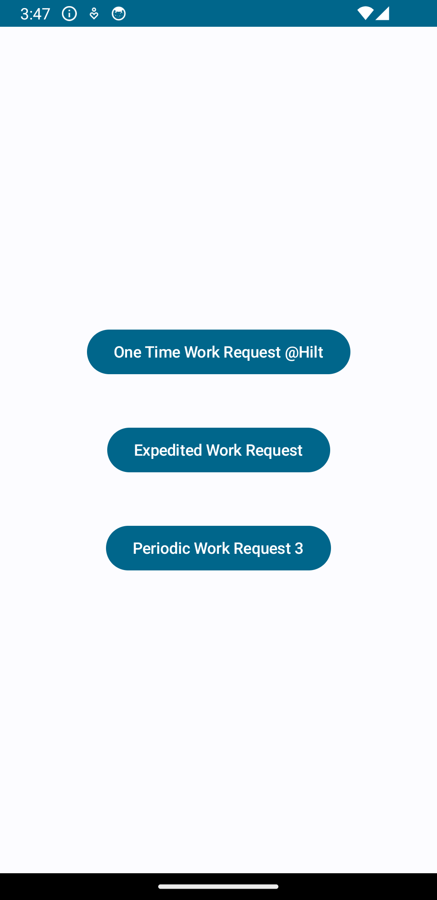

# WorkManager-Demo

## Description

WorkManager-Demo is an Android application focusing on demonstrating the usage of Android WorkManager. This project serves as a comprehensive guide on implementing background tasks and scheduling them effectively using WorkManager in modern Android development.

### Technologies Used:

- **Kotlin**
- **Android WorkManager**
- **Jetpack Compose**
- **Hilt Dependency Injection**
- **MVVM**
- **Clean Code Architecture**

WorkManager-Demo showcases best practices in Android development by leveraging these technologies.

## Screenshots

## Table of Contents

- [Installation](#installation)
- [Usage](#usage)
- [Contributing](#contributing)
- [License](#license)

## Installation

1. Clone the repository:
git clone https://github.com/rahulgothwal5/WorkManager-Demo.git

2. Open the project in Android Studio.

## Usage

Explore the codebase to learn how to implement background tasks and scheduling them effectively using **WorkManager** in your Kotlin Android app. This project demonstrates three types of workers:

- **Periodic Workers**: These workers execute periodically at specified intervals.
- **Expedited Workers**: These workers execute as soon as possible.
- **OneTime Workers**: These workers execute once.

Make use of **Jetpack Compose** for UI, **Hilt Dependency Injection** for managing dependencies, and ensure adherence to **MVVM** and **Clean Code Architecture** principles.

## Contributing

1. Fork the repository.
2. Create a new branch (`git checkout -b feature/your-feature-name`).
3. Make your changes.
4. Commit your changes (`git commit -am 'Add new feature'`).
5. Push to the branch (`git push origin feature/your-feature-name`).
6. Create a new Pull Request.

## License

This project is licensed under the [MIT License](LICENSE).
